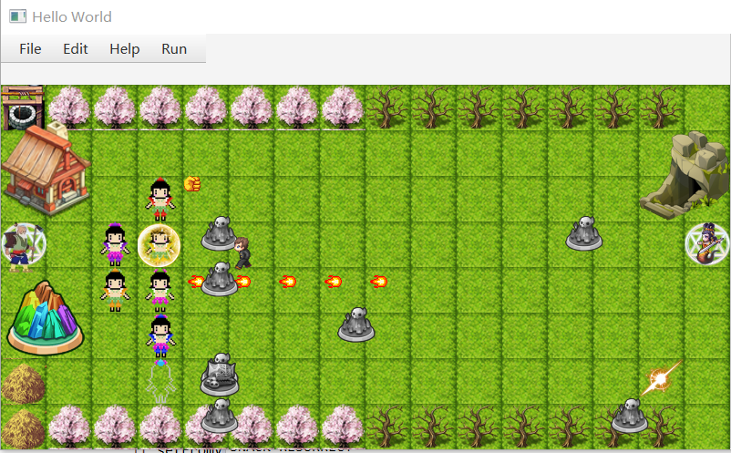

# 葫芦娃大战蛇精——完成版

171860033 黄诗涵



## 运行方法

运行Main类的main方法打开UI

### Run->Start New Battle

与按空格效果不一样，不可混用。
开启新的战斗，结束后按S可保存记录

### File->Save Record（快捷键 S）

保存战斗记录，但请在战斗结束后再保存，不然数据不完整

### File->Open File（快捷键 L）

打开文件对话框，选择一个记录读取，按**空格**回放

## 功能介绍

* 蛇精方：10个小喽啰，1个蝎子精，1个蛇精
* 葫芦娃方： 1个爷爷，7个葫芦娃

### 生物体特点

* 爷爷：不参与战斗，每0.5s给场上所有活着的葫芦娃回复一定量生命值
* 红娃：【大力士】攻击前方一格，高额攻击力
* 橙娃：【千里眼】攻击离自己最远的敌方，不包括蛇精
* 黄娃：【刀枪不入】具有护盾，高额防御力，攻击九宫格内任一敌方
* 绿娃：【喷火】攻击前方5格，有火焰特效
* 青娃：【喷水】攻击前方一列，有水柱特效
* 蓝娃：【隐身】不被敌方攻击
* 紫娃：【宝葫芦】每1.5秒，回收敌军一具尸体，即[使敌军不可复活]

* 蛇精：不参与战斗，每2s随机复活一名死亡小喽啰（包括蝎子精）
* 蝎子精：移动速度较快，攻防皆高
* 小喽啰：攻击九宫格内任一敌方

### 胜利条件

> 葫芦娃胜利: 蝎子精和小怪全部死亡，或者消灭超过20个怪物  
> 蛇精胜利：7个葫芦娃全部死亡，或者有三个及以上的己方进入防线（x轴为0）

## 设计思路

基于前几次大作业已有的生物体类，添加了能实时更新GUI的功能。  
为了让生物体线程在运行时刻即能显示在画面中，我让基类继承了javafx.scene.Parent,这是所有控件的基类，于是我的生物体类型可以看作一个控件，调用继承的函数改变坐标实现在地图上移动。

基类还继承Runnable接口用以实现多线程。派生类重写基类的接口实现生物体不同的移动模式，攻击模式等。


### 重要类简介

#### 生物体类[Organism]  

生物体的基类[Organism]继承了Parent类和Runnable接口和自定义的接口。
生物体的属性包括:
> 生命值，攻击力，防御力等；
> 战斗状态信息：比如战斗中，葫芦娃队胜出，蛇精队胜出；
> 图像，用于在界面中显示生物体；
> 位置信息，自己所在的位置，通过访问地图可访问站在其他地板上的生物体

生物体的派生类包括：
> 葫芦娃，葫芦娃又有派生类，红娃，橙娃等
> 爷爷
> 怪物，蝎子精继承怪物[Monster]类
> 蛇精


#### 战斗地图[BattleMap]

战斗地图相当于一个战场的管理员，它提供地图，布置地图（将生物体安置在指定位置），控制战斗的开始

#### 记录类[Record]

用于战斗回放。每个生物体线程在运行时独立记录自己的动作  
记录类的成员是一个[Detail]类的向量，每一个Detail对象表示一次动作
记录了动作的类型，生物体当前的信息，和时间  

#### OrganismSerial
用于序列化和反序列化  
继承Serializable接口，存储了生物体对象的初始化信息，单次战斗信息。
>ObjectInputStream.writeObject方法将对象序列化后输出到文件
>ObjectInputStream.readObject方法将IO流恢复成对象


### 与GUI相关的类

#### Main

public Class Main 是程序的入口  
Main的start方法中加载了FXML.xml文件，调用Controller类的初始化函数，启动了图形界面主窗口

#### Controller
Controller是负责与FXML通信的类，通过它访问.fxml文件中的控件，也能新建控件加入界面。
主要方法：
> initialize:在加载时自动调用，用于初始化UI
> initCharacters：初始化即将加入战斗的生物体。为了能将生物体作为控件加入布局，必须在Controller类中能访问到生物体
> savaFile/openFile:利用javafx提供的FileChooser类打开文件对话框，便利地获取文件地址，存取被序列化的生物体信息/记录对象，用于战斗回放。


## 实现过程

### 搭建初步的框架

配置好javaFx环境，熟悉各种类
接触javaFX之前只用过QT做图形界面，也没有写过并发的图形界面项目，不知道如何通过线程去刷新UI，也对作业要求中的“战斗回放”比较疑惑，一开始理解为等所有线程结束后根据战斗记录去做一个动画。
但是回想玩过的游戏，这样的逻辑显然不合理，于是寻找能实时刷新的方法。
在网上看到的一个用人物类继承java.scene.Parent的博客启发了我，将生物体对象当作控件就好，与一般的Button,Label没有区别，也方便设置图片。

战斗背景的像素为800x400，使用scene builder搭建。在素材网站上找了一些png格式的图片，用PS剪切成50x50的小块，拼成一个rpg风格的地图。

在Controller中设置MenuBar,添加事件响应和快捷键等。

### 并发编程

创建线程池

```java
  ExecutorService exec = Executors.newFixedThreadPool(100);
```

生物体继承Runnable接口，添加run()方法
生物体主要需要实现：移动，攻击
其他的功能可后续逐渐完善
为了实现线程同步，需要在合适的地方添加同步块
#### 移动
葫芦娃和小怪的行动模式很类似，只是移动方向不同
调用move方法，首先检查前方是否存在生物体，因为所有生物体共享同一个地图，如果有两个生物体同时访问另一个生物体，很可能会出问题，所以这里需要加synchronized实现串行的访问。
如果前方地板为空，则前进一格，否则放弃此次移动转为攻击模式

#### 攻击
为了观赏性，我设置了生命值，攻击力，防御力等属性。
小怪的攻击模式是：周围九宫格内存在敌方时，任意攻击一个生物体。
（葫芦娃每个个体攻击模式不一样，不用作举例）
攻击实质上是调用敌方的deductHp()方法。
这里就用到了泛型与反射机制，因为运行过程中，并不知道地图上某个位置的生物体是什么类的对象，可用Class.isInstance方法判断。
Method.invoke方法可调用未知类的方法。
synchronized同步块确保同时只有一个线程在修改生物体生命值。

### 设计游戏模式

这次大作业题目非常灵活，让我有机会自己设计游戏设定并独立实现。
在无数次调试过程中，我发现在双方都移动的过程中，如果没有索敌的方法。很难保证有一方全部死亡。
所以我采用了经典塔防的模式，让葫芦娃一方站在固定位置，蛇精的小喽啰作为攻防前进。


### 优化画面

#### 移动画面

javafx中有PathTransition类，可以让图像沿直线移动
但这里遇到的问题是，多个生物体会同时移动，而导致卡死，一个较安全的写法是：

```java
  new Thread(() -> {
                Semaphore semaphore = new Semaphore(1);
                try {
                    semaphore.acquire();
                    Platform.runLater(() -> {
                        ......
                        semaphore.release();
                    });
                } catch (InterruptedException e) {
                    e.printStackTrace();
                }
    }).start();
```

这样就确保只会有一个线程进入临界区。

Controller类中，执行耗时较长的任务也用到了这个方法。如果不新建线程，UI就会一直等待这个任务结束，导致UI不能刷新，甚至会卡死。

#### 攻击特效

做攻击特效我最常用的是javafx.animation.FadeTransition
可以在规定时间内使图像淡出。


## 设计原则

### SRP 单一职责原则

重要类都只负责一个功能
Organism类需要多个功能：它是线程/控件/生物体
于是通过继承多个接口，实现功能的分离，互不干扰。
Main: 启动UI
Controller: 管理图形界面
OrganismData: 存储初始化数据
OrganismSerial: 完成序列化
BattleMap: 管理战斗地图

### OCP 开放封闭原则

当需要扩展的时候，继承一个生物体即可而不需要修改原本的代码
比如为葫芦娃添加功能不需要改变Huluwa类的代码，只需要添加新的葫芦娃（Red,Orange...），重写葫芦娃里的方法。

### LSP 里氏替换法则

子类中所有方法都在基类中有声明

### ISP 接口隔离原则

设置有四个接口，分别负责UI，战斗动作，线程，设置数据。
只需要继承需要的接口

### DIP 依赖倒置原则

不在BattleMap类中创建生物体对象，而从外部传入对象。
不关注依赖的创建。

## 项目结构

项目名为HuluwaProject,是用Maven管理的JavaFX项目

```java
 HuluwaProject/
|-- pom.xml
|-- src
|   |-- main
|   |   |-- java
|   |   |   |-- huluwabattle
|   |   |   |   |-- Controller.java
|   |   |   |   |-- Main.java
|   |   |   |   |-- OrganismSerial.java
|   |   |   |   |-- huluwabattle.fxml
|   |   |   |-- myinterfaces
|   |   |   |   |-- CreatureActions.java
|   |   |   |   |-- CreatureThread.java
|   |   |   |   |-- CreatureUI.java
|   |   |   |   `-- OrganismSettings.java
|   |   |   |-- myorganism
|   |   |   |   |-- BattleMap.java
|   |   |   |   |-- Blue.java
|   |   |   |   |-- Grandfather.java
|   |   |   |   |-- Green.java
|   |   |   |   |-- Huluwa.java
|   |   |   |   |-- Indigo.java
|   |   |   |   |-- InitModule.java
|   |   |   |   |-- Monster.java
|   |   |   |   |-- Orange.java
|   |   |   |   |-- Organism.java
|   |   |   |   |-- Position.java
|   |   |   |   |-- Purple.java
|   |   |   |   |-- Red.java
|   |   |   |   |-- Scorpion.java
|   |   |   |   |-- Snack.java
|   |   |   |   |-- Species.java
|   |   |   |   `-- Yellow.java
|   |   |   `-- organismdata
|   |   |       |-- Detail.java
|   |   |       |-- OrganismData.java
|   |   |       `-- Record.java
|   |   |-- outputFiles
|   |   |   |-- battleRecord.ser
|   |   |   |-- battleRecord2.ser
|   |   |   |-- battleRecord3.ser
|   |   |   |-- record.ser
|   |   |   `-- record2.ser
|   |   `-- resources
|   |       `-- image
|   `-- test
|       |-- java
|       |   |-- huluwabattle
|       |   |   `-- OrganismSerialTest.java
|       |   |-- myorganism
|       |   |   |-- InitModuleTest.java
|       |   |   |-- OrganismTest.java
|       |   |   `-- PositionTest.java
|       |   `-- organismdata
|       `-- resources


```  
